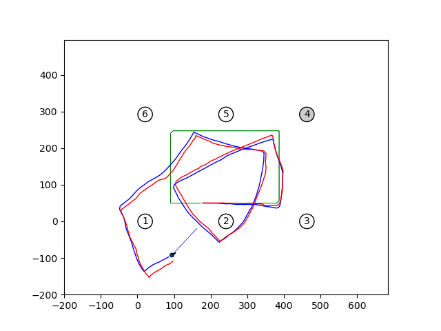

# TO4 - EKF y PF

## Ejercicio 3 y 4 punto a
```bash
python3 ejer_3y4a.py
```
Primero correrá el EKF, finalizado el mismo, al cerrar la figura obtenida, comenzará a correr el PF



<!-- 

 -->

## Ejercicio 3 y 4 punto b
```bash
python3 ejer_3y4b.py
```
Se ejecutan todas las combinaciones pedidas de parámetros de los filtros y finalmente se muestra los resultados en dos figuras.


## Ejercicio 3 y 4 punto c
```bash
python3 ejer_3y4c.py
```
Se ejecutan todas las combinaciones pedidas de parámetros de los filtros y finalmente se muestra los resultados en dos figuras.


## Ejercicio 4 punto d
```bash
python3 ejer_4d.py
```
Se ejecutan todas las combinaciones pedidas de parámetros del PF y finalmente se muestra los resultados en una figura.


